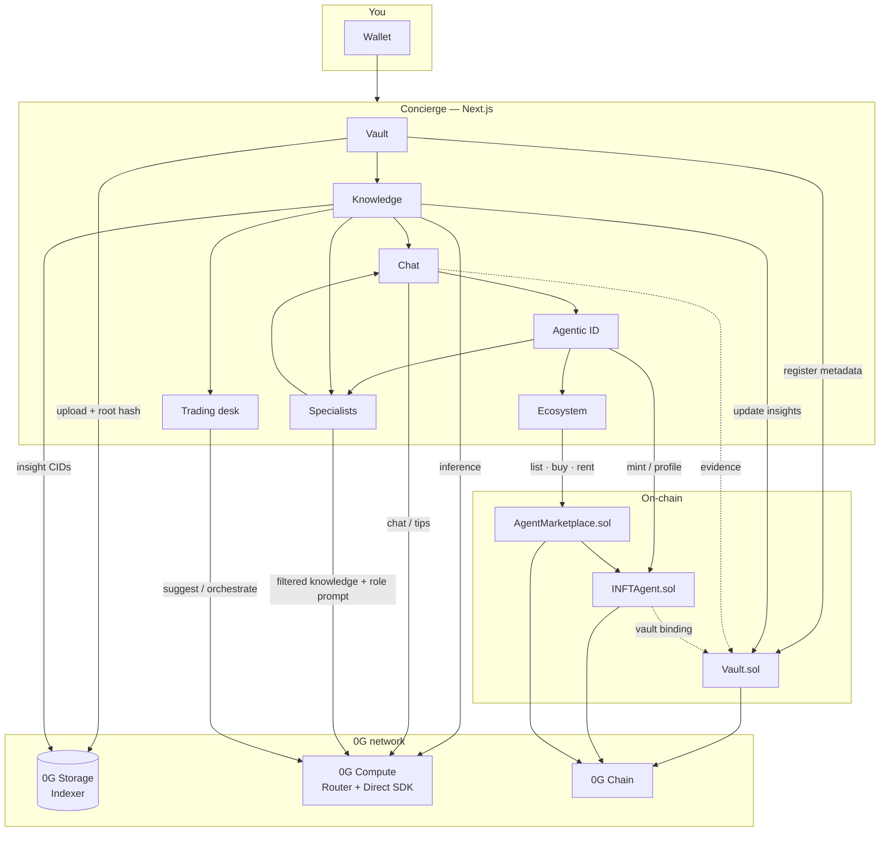

# Concierge

**Your personal AI Concierge on 0G** — one private vault of life data, one portable **Agentic ID**, and a marketplace to sell or rent that intelligence. Built for the [0G Bridge Buildathon](https://app.akindo.io/wave-hacks/Z4MlX4vreI72ol6pd) (AKINDO).

> **Wave 3 deep dive (addresses, explorer txs, integration proof):** [OG_BRIDGE_WAVE3.md](./OG_BRIDGE_WAVE3.md)  
> **Program one-pager:** [OG_BRIDGE.md](./OG_BRIDGE.md) · **Wave 1 notes:** [WAVE1_UPDATES.md](./WAVE1_UPDATES.md)

## Quick links

- [Live app](http://concierge-sigma.vercel.app/)
- [0G Docs](https://docs.0g.ai) · [Agentic ID](https://docs.0g.ai/concepts/agentic-id)
- [Demo video](https://youtu.be/PY_HBcew6oM) · [Product thread](https://x.com/mananbuilds/status/1985758895386800449)

---

## Vision

People’s most useful context — bills, writing samples, travel, subscriptions — is trapped in downloads and inboxes. Generic chatbots cannot use it. Cloud “memory” products do not give you an asset you own.

**Concierge’s bet:** personal intelligence should be **user-owned, vault-backed, and transferable** — and eventually **specialized**.

1. **Ingest** — documents land on **0G Storage** and are registered in **Vault.sol**.  
2. **Understand** — **0G Compute** turns files into agent knowledge (category + summary).  
3. **Converse** — Chat answers from *your* vault, not a generic model persona.  
4. **Own** — mint one **Agentic ID** per wallet (name, bio, vault fingerprint).  
5. **Specialize** — soft specialists (copywriter, trade strategist, finance advisor…) pull filtered slices of that knowledge so agents sound human and domain-sharp — still one on-chain ID.  
6. **Circulate** — sell, rent, or transfer that ID; vault binding travels with the token.

Long-term: Concierge is how you carry a portable AI identity on 0G — tradeable, rentable, and grounded in private data you control. Trading desk assist and strategy drafting are first-class extensions of the same vault → Compute loop.

---

## What Concierge does today

| Stage | What you get |
|-------|----------------|
| **Vault** | Upload to 0G Storage; on-chain file registry |
| **Knowledge base** | Feed stored files through Compute; chat-ready summaries |
| **Chat** | Vault-grounded Concierge; operator-funded free tier via Private Computer Router |
| **Agentic ID** | Mint / update personality bound to your vault |
| **Specialists (foundation)** | Soft personas from knowledge filters — see `lib/specialists/` |
| **Trading desk** | Secondary: trade assist / strategies via Compute (maturing) |
| **Ecosystem** | Marketplace sale, timed rental, P2P transfer |

Default network for demos: **0G Galileo (16602)**. Production contracts are live on **0G Mainnet (16661)** — switch in RainbowKit.

---

## Architecture



**Data path (short):** device → **0G Storage** → **Vault.sol** → **0G Compute** → knowledge → **Chat** / **Specialists** / **Trading assist** → **Agentic ID** → **Marketplace**.

Foundation for specialists (no second NFT yet): `lib/specialists/` — catalog, knowledge filters, Compute prompts. Deep wiring and explorer proofs: [OG_BRIDGE_WAVE3.md](./OG_BRIDGE_WAVE3.md).

---

## Contracts

| Contract | Galileo (16602) | Mainnet (16661) |
|----------|-----------------|-----------------|
| **Vault** | [`0x845Dc38f…257B81`](https://chainscan-galileo.0g.ai/address/0x845Dc38fCe646C1F0FeB5b607B069D6A62537B81) | [`0x02AEA2c7…0893c8`](https://chainscan.0g.ai/address/0x02AEA2c7E88E2e96CD4A02Ff3BA54f90520893c8) |
| **Agentic ID** | [`0x7fE958Ca…D89389`](https://chainscan-galileo.0g.ai/address/0x7fE958CaF70cdcEC187f30A216924878e2D89389) | [`0x721c164D…e05f`](https://chainscan.0g.ai/address/0x721c164D1c7e67e522d50194C342006E36Fde05f) |
| **Marketplace** | [`0x2DfB5d44…b209c`](https://chainscan-galileo.0g.ai/address/0x2DfB5d4459a6ebda06ffBBec03F44a0d714b209c) | [`0x5cbAdD85…121Ac`](https://chainscan.0g.ai/address/0x5cbAdD85bb8f96d8c5b43c7Ae18819F29Cc121Ac) |

---

## Buildathon roadmap & next steps

| Wave | Status | Focus |
|------|--------|--------|
| **1** | Done | Scope, SDK migration, journey UX — [WAVE1_UPDATES.md](./WAVE1_UPDATES.md) |
| **2** | Done | End-to-end testnet demo + video |
| **3** | **This branch (`wave3_2026`)** | Mainnet marketplace + upgrades, operator Router compute, vault chat, specialist **foundation** — [OG_BRIDGE_WAVE3.md](./OG_BRIDGE_WAVE3.md) |
| **4** | **Next** | Production polish + lend access + specialists + trade assist |
| **5** | **After** | Demo Day (Token2049 Singapore) + deeper finance/strategies + ERC-7857 story |

### Wave 4 — production polish & lend access (next)

- Harden the core loop for production: reliability, quotas, error UX, mainnet defaults where safe.  
- **Lend access** (foundation in `lib/lendAccess/`): let someone use your Concierge for a timed period without seeing private files — choose what they can ask about; use history grows with real activity.  
- Activate **specialists** from `lib/specialists/` when useful for chat roles.  
- Polish **Trading desk**: assist-only suggestions grounded in vault knowledge.

### Wave 5 — Demo Day & depth

- Live mainnet walkthrough: vault → knowledge → chat → Agentic ID → lend / marketplace.  
- Deeper trade assist with 0G Compute.  
- Pitch: ERC-7857 alignment, partner “sign in with Concierge ID”.

### Planned extensions

- Full **ERC-7857** Agentic ID alignment.  
- Wire lend-access passes into marketplace rentals (guest asks through an allowed slice only).  
- Partner apps that load a Concierge by token ID.  
- Mainnet-first Storage + Compute defaults.

---

## Quick start

```bash
npm install --legacy-peer-deps
cp .env.example .env   # OG_ROUTER_API_KEY from https://pc.0g.ai + wallet keys
npm run dev
```

Open [http://localhost:3000](http://localhost:3000) → connect on **Galileo**.  
Contract sync / deploy commands and full env table: [OG_BRIDGE_WAVE3.md](./OG_BRIDGE_WAVE3.md).

---

## Tech stack

Next.js 15 · React 19 · wagmi / RainbowKit / viem · Solidity 0.8.28 · Hardhat · OpenZeppelin 5.6 · `@0gfoundation/0g-storage-ts-sdk` · `@0gfoundation/0g-compute-ts-sdk` · `@0gfoundation/0g-pay-sdk`

## Docs in this repo (2026)

| Doc | Role |
|-----|------|
| [README.md](./README.md) | Product vision, architecture, roadmap |
| [OG_BRIDGE.md](./OG_BRIDGE.md) | Buildathon one-pager |
| [OG_BRIDGE_WAVE3.md](./OG_BRIDGE_WAVE3.md) | Wave 3 technical submission |
| [WAVE1_UPDATES.md](./WAVE1_UPDATES.md) | Wave 1 changelog |

## License

MIT

---

Built on 0G. [Wave 3 notes](./OG_BRIDGE_WAVE3.md) · [0G Bridge](https://app.akindo.io/wave-hacks/Z4MlX4vreI72ol6pd).
