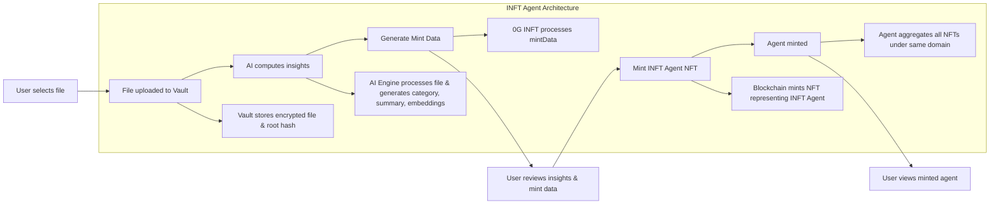

# INFT Agent Integration Update

This update introduces a fully integrated **Intelligent NFT (INFT) Agent** system leveraging **0G's INFT storage and AI compute infrastructure**. The implementation enables users to upload files, generate AI-powered insights, and mint domain-specific NFT agents through a modular and transparent architecture.

## Core Features

### User Interface Components

**Dashboard Integration**
- `app/dashboard/agent/overview/page.tsx`
  - Centralized overview of user's INFT Agent
  - Interactive demo wizard for testing end-to-end file processing and agent creation
  - Real-time status monitoring and agent management

### API Architecture

The system exposes three specialized API endpoints for enhanced modularity and transparency:

**Compute Insights API**
- Route: `api/computeInsights/route.ts`
- Functionality: Processes uploaded files to generate AI insights, embeddings, and domain categorization
- Integrates with 0G's AI compute layer for intelligent content analysis

**Ledger Management API**
- Route: `api/ledger/route.ts`
- Functionality: Manages ledger operations for minted INFTs
- Provides transparent tracking of all INFT transactions and state changes

**Model Management API**
- Route: `api/models/route.ts`
- Functionality: Handles AI model selection and configuration for processing pipelines
- Enables flexible model deployment and version control

### Component Library

Two specialized React components power the INFT Agent interface:

**INFT Agent Demo Component**
- File: `MyAgent/INFTAgentDemo.tsx`
- Purpose: Provides a mock wizard for testing and demonstration
- Features step-by-step guidance through the agent creation process

**INFT Agent UI Component**
- File: `MyAgent/INFTAgentUI.tsx`
- Purpose: Production interface for INFT Agent interactions
- Handles real-time agent queries, updates, and management

### Smart Contract Layer

**INFT Agent Contract**
- File: `contracts/Agent/INFTAgent.sol`
- Functionality: Aggregates multiple file NFTs under a unified domain into a single INFT Agent NFT
- Implements domain-based organization and agent lifecycle management
- Ensures secure minting and ownership verification

### Frontend Integration

**Custom React Hook**
- File: `hooks/useINFTAgent.ts`
- Functionality: Manages INFT Agent data and interactions across the application
- Provides state management, data fetching, and action dispatching
- Simplifies component integration with consistent API

## INFT Agent Architecture Flow

## System Architecture

### Vault Storage Layer
Files are securely stored using 0G's INFT storage vault with built-in encryption and cryptographic root hash tracking. This ensures data integrity and verifiable storage.

### AI Compute Layer
0G's compute engine analyzes uploaded content to generate comprehensive insights including:
- Semantic embeddings for content understanding
- Automated domain categorization
- Intelligent summaries and metadata extraction

### Minting and Aggregation
The system supports two-tier NFT creation:
- **File-level NFTs**: Individual files can be minted as standalone NFTs
- **Agent-level NFTs**: Multiple NFTs sharing the same domain are aggregated into a unified INFT Agent NFT, creating a cohesive digital entity

### Transparency and Control
Modular API design provides users with:
- Clear visibility into processing pipelines
- Granular control over minting parameters
- Comprehensive ledger management and audit trails

## End-to-End Workflow

This implementation delivers a complete user journey from initial file upload through final agent minting, enabling seamless interaction with AI-powered INFT Agents. The architecture prioritizes transparency, modularity, and user control throughout the entire process.

## Technical Benefits

**Scalability**: Modular API design allows independent scaling of compute, storage, and blockchain components

**Security**: Multiple layers of encryption and cryptographic verification protect user data and agent integrity

**Flexibility**: Domain-based aggregation enables logical organization of related content under unified agent entities

**Transparency**: Every step of the process is traceable and auditable through the ledger management system
